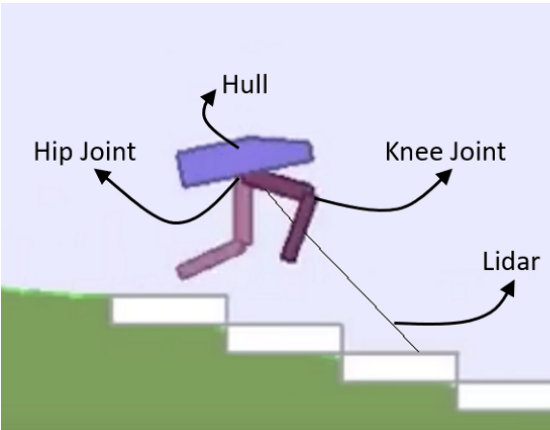
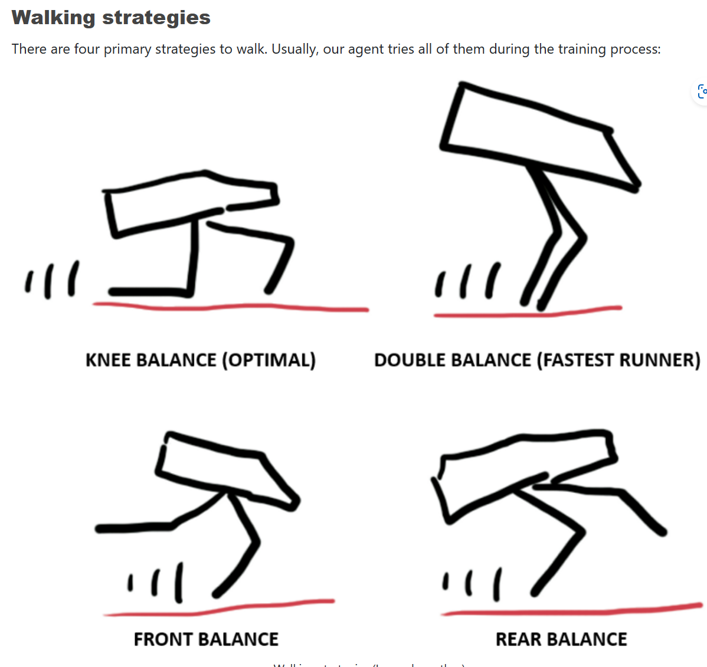
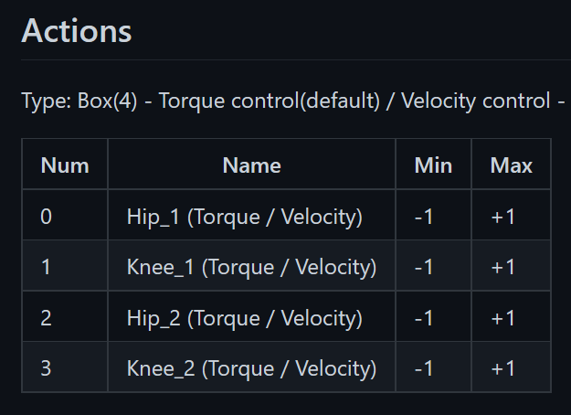
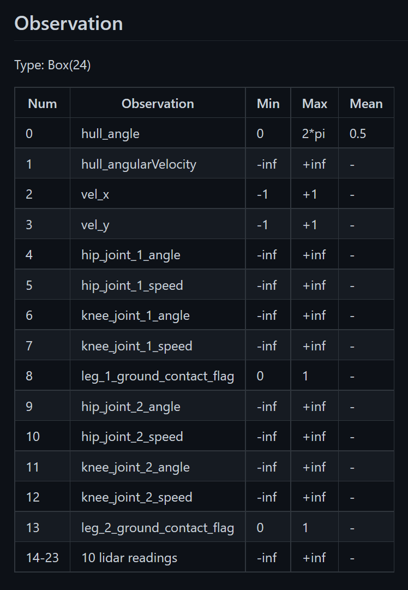
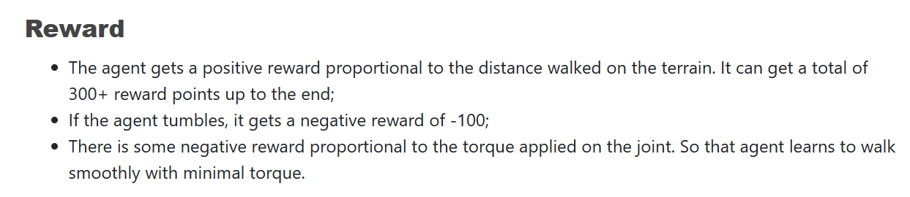
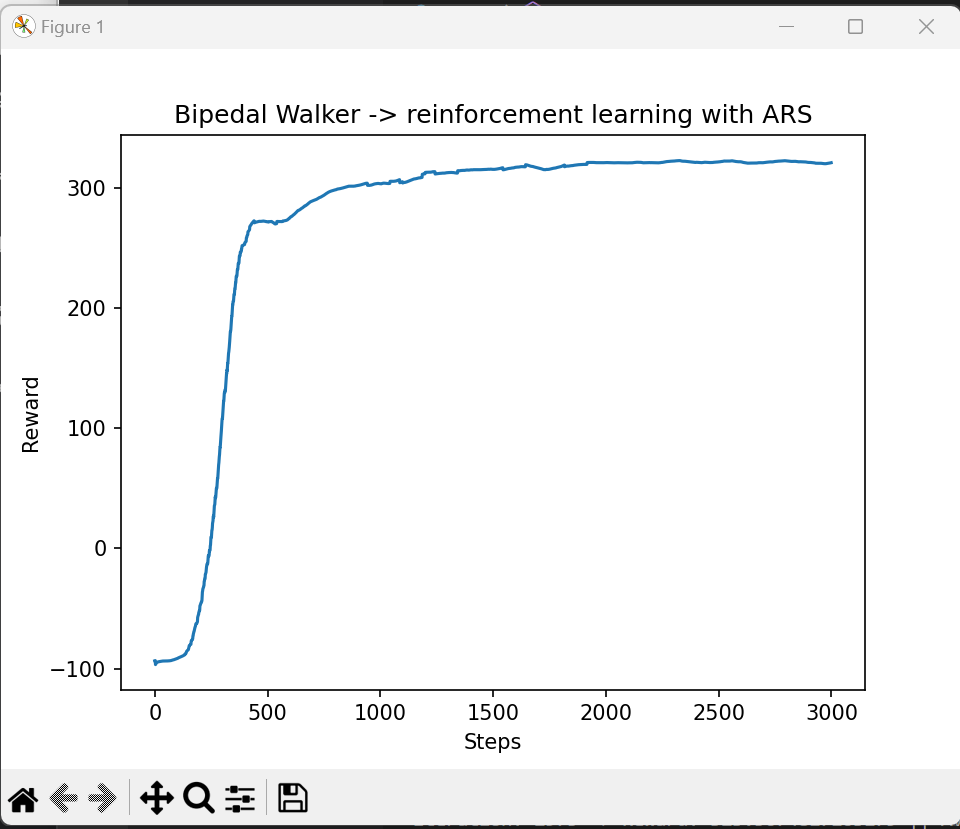
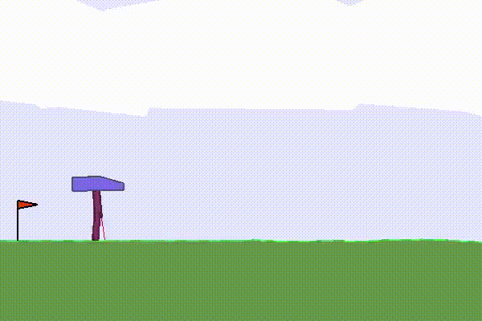
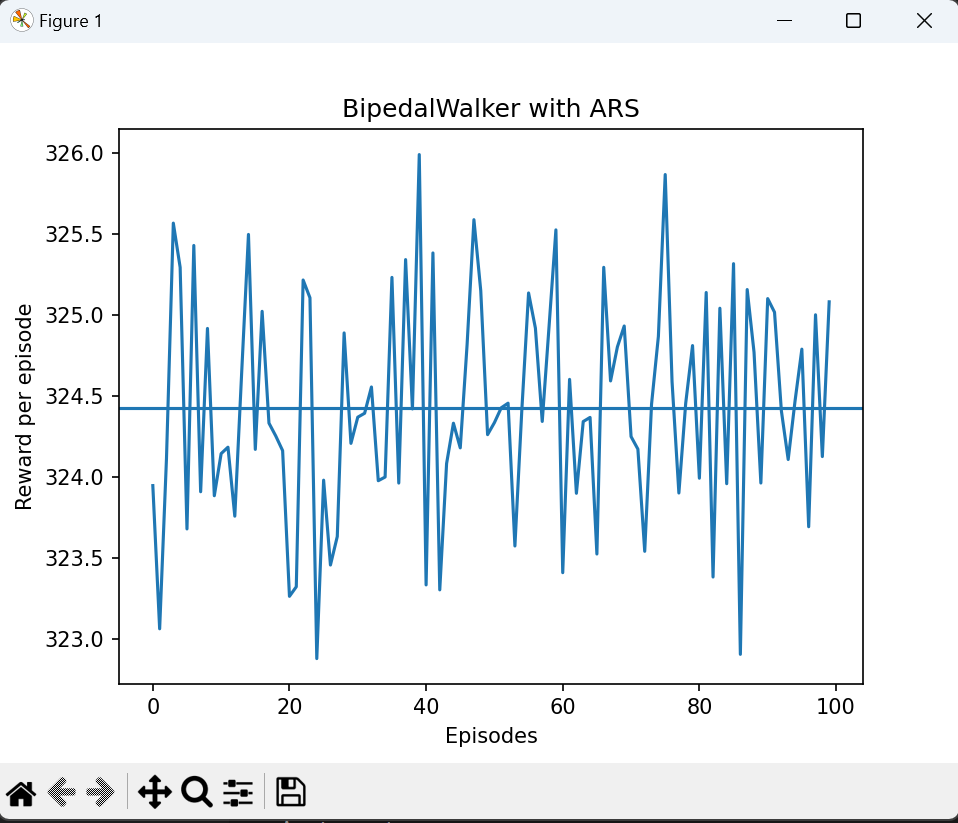

# <b>Bipedal Walker</b>

 

 

This environment is part of the Box2D environments.
Information about the environment:

| &nbsp;     |            |
|------------|------------|
| <b>Action Space</b>  | 	Box(-1.0, 1.0, (4,), float32)    |
| <b>Observation Space</b>  | Box([-3.1415927 -5. -5. -5. -3.1415927 -5. -3.1415927 -5. -0. -3.1415927 -5. -3.1415927 -5. -0. -1. -1. -1. -1. -1. -1. -1. -1. -1. -1. ], [3.1415927 5. 5. 5. 3.1415927 5. 3.1415927 5. 5. 3.1415927 5. 3.1415927 5. 5. 1. 1. 1. 1. 1. 1. 1. 1. 1. 1. ], (24,), float32)     |
| <b>Import</b>  | gymnasium.make("BipedalWalker-v3")     |

 

 

  

## Description

 

This is a simple 4-joint walker robot environment. There are two versions:
+ <b>Normal, with slightly uneven terrain</b>.
+ Hardcore, with ladders, stumps, pitfalls.

To solve the normal version, you need to get 300 points in 1600 time steps. 

To solve the hardcore version, you need 300 points in 2000 time steps.

  

## Action Space

 

Actions are motor speed values in the [-1, 1] range for each of the 4 joints at both hips and knees.

 

  

## Observation Space

 

State consists of hull angle speed, angular velocity, horizontal speed, vertical speed, position of joints and joints angular speed, legs contact with ground, and 10 lidar rangefinder measurements. There are no coordinates in the state vector.

 

  

## Rewards

 

Reward is given for moving forward, totaling 300+ points up to the far end. If the robot falls, it gets -100. Applying motor torque costs a small amount of points. A more optimal agent will get a better score.

 

  

## Starting State

 

The walker starts standing at the left end of the terrain with the hull horizontal, and both legs in the same position with a slight knee angle.

  

## Episode Termination

 

The episode will terminate if the hull gets in contact with the ground or if the walker exceeds the right end of the terrain length.

  

## Results

 

The results were obtained using the Augmented Random Search (ARS) algorithm.

 

Training phase:

 

 

Testing:

 

 

  